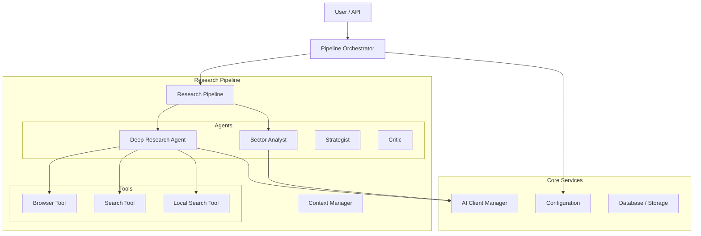

# Agent Guide: Company Researcher System

Welcome to the **Company Researcher System**! This guide is designed to give you a complete understanding of the project, its architecture, and how to contribute effectively.

## 1. Project Overview

The **Company Researcher System** is an autonomous multi-agent platform designed to conduct deep, comprehensive research on companies. It goes beyond simple scraping by using a team of specialized AI agents to gather, analyze, and synthesize information into structured reports.

### Key Goals

- **B2B Sales Intelligence**: Identify pain points and strategic gaps.
- **Investment Analysis**: Detect growth signals and risks.
- **Comprehensive Reporting**: Generate detailed markdown reports (20+ sections).

## 2. Architecture

The system follows a **Pipeline Architecture** (replacing the older LangGraph state machine) for better testability and reliability.

### High-Level Diagram



### Key Components

#### 2.1. Pipeline Orchestrator (`src/pipeline/orchestrator.py`)

- **Role**: The central coordinator. It manages the research process, handles retries, timeouts, and error reporting.
- **Usage**:
  ```python
  from src.pipeline.orchestrator import PipelineOrchestrator
  orchestrator = PipelineOrchestrator()
  result = await orchestrator.conduct_research("Acme Corp", "https://acme.com")
  ```

#### 2.2. Agents (`src/agents/`)

- **Deep Research Agent** (`deep_research.py`): The workhorse. Performs recursive search and scraping.
- **Base Agent** (`base_agent.py`): The parent class for all agents.

#### 2.3. Core Services (`src/core/`)

- **AI Client Manager** (`ai_client.py`): Manages connections to OpenAI, Anthropic, Gemini, etc. Handles fallbacks and rate limiting.
- **Configuration** (`config.py`): Centralized config using Pydantic. Supports profiles (dev, staging, prod).
- **Browser Tool** (`src/tools/browser.py`): Handles web scraping using Playwright with anti-bot measures.

## 3. Development Workflow

### 3.1. Adding a New Agent

1.  Inherit from `BaseAgent` in `src/agents/`.
2.  Implement the `research` method.
3.  Register the agent in the `ResearchPipeline`.

### 3.2. Adding a New Tool

1.  Create a new class in `src/tools/`.
2.  Ensure it handles errors gracefully and logs activities.
3.  Add it to the `DeepResearchAgent` or other relevant agents.

### 3.3. Running Tests

- **Unit Tests**: `pytest tests/unit`
- **Integration Tests**: `pytest tests/integration`
- **End-to-End Tests**: `pytest tests/e2e`

## 4. API Reference

The system exposes a REST API via FastAPI (`src/api/app.py`).

- **POST /api/v1/research**: Start a research task.
- **GET /api/v1/research/{task_id}**: Check task status.
- **GET /health**: System health check.

## 5. Configuration

Configuration is managed via `.env` file and environment variables. See `src/core/config.py` for all options.

### Key Variables

- `OPENAI_API_KEY`: Primary AI provider key.
- `TAVILY_API_KEY`: Search API key.
- `OUTPUT_DIR`: Directory for generated reports.

## 6. Best Practices

- **Error Handling**: Always use `try/except` blocks in tools and agents. Use `capture_exception` for tracking.
- **Logging**: Use `setup_logger` from `src.core.logger`.
- **Async**: The entire system is async. Avoid blocking calls.
- **Type Hinting**: Use Python type hints everywhere.

---

_This guide is maintained by the AI Whisperers team. Last updated: December 2025._
