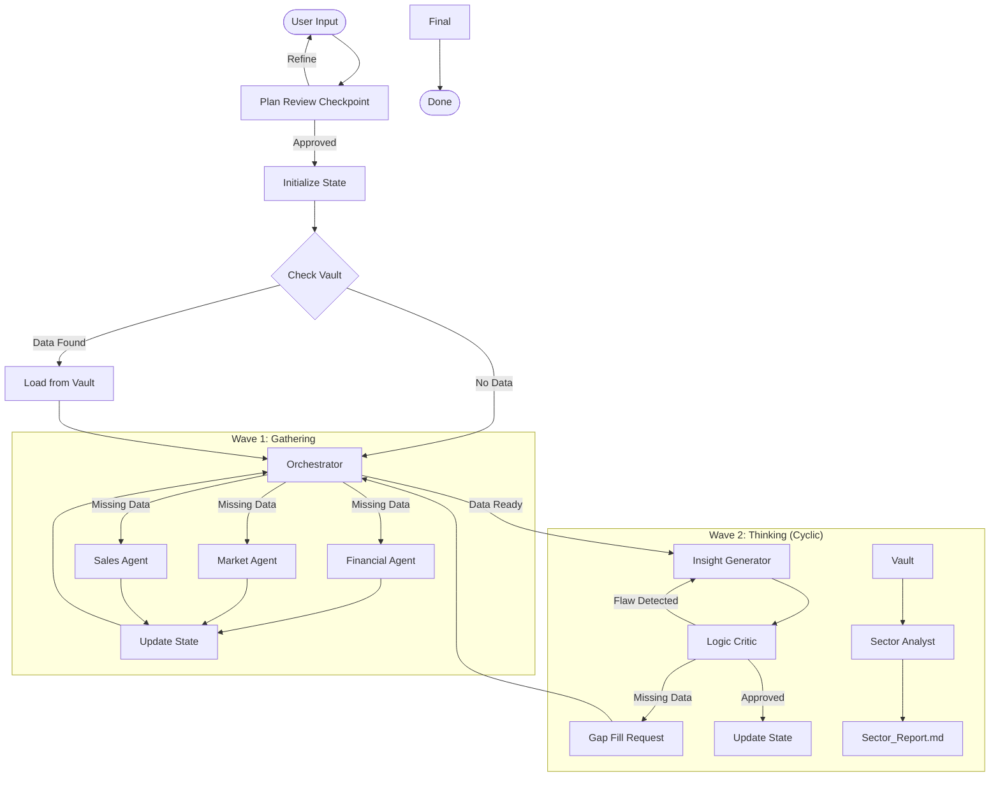

# Agentic Architecture & Topology

**Objective**: Define the structural design of the system, focusing on state management, cyclic data flow, and the "Sector Brain".

## 🧩 System Topology

We use a **Hub-and-Spoke** topology with a **Shared State (Blackboard)** and a **Knowledge Vault**.

### 1. The Hub: Orchestrator

- **Function**: The central node in the LangGraph.
- **Logic**: Evaluates `GlobalState`, manages the **Budget**, and decides the next step.
- **Decision Engine**: Checks `Research_Data_Master.md` completeness and `LogicCritic` feedback.

### 2. The Spokes: Specialist Agents

- **Function**: Stateless execution units.
- **Input**: Task + Access to "The Vault".
- **Output**: Update to `GlobalState`.

### 3. The Blackboard: Global State

- **Function**: Single source of truth for the _current_ run.
- **Implementation**: Pydantic model.

### 4. The Vault: Cross-Project Memory

- **Function**: Long-term storage for all companies.
- **Implementation**: Vector DB (Pinecone) + Graph DB (Neo4j).
- **Usage**: Checked _before_ any new scraping to save costs.

## 🔄 Interaction Flow (The Cyclic Graph)

