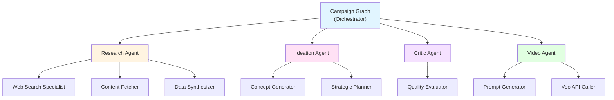
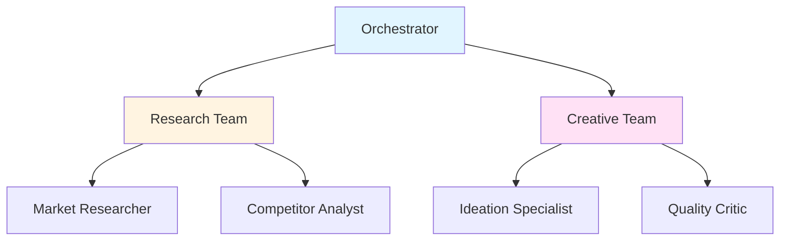

# Multi-Agent Collaboration Pattern

## 📖 Overview

Multiple specialized AI agents work together, each with specific expertise, to solve complex problems collaboratively.

## 🎯 Core Concept

Instead of one generalist agent:

- **Specialized Agents**: Each expert in one domain
- **Collaboration**: Agents share insights
- **Delegation**: Tasks routed to best agent
- **Coordination**: Central orchestration

## 💡 Key Benefits

- **Specialization**: Expert agents per task
- **Parallel Execution**: Concurrent work
- **Better Quality**: Domain expertise
- **Scalability**: Add agents as needed

## 🏗️ Implementation in Marketing Agent

### Agent Architecture



### Agent Workflow

```python
class CampaignGraph:
    """Multi-agent orchestrator using LangGraph"""

    def __init__(self):
        self.graph = StateGraph(CampaignState)

        # Register specialized agents
        self.graph.add_node("research", research_node)
        self.graph.add_node("synthesis", synthesis_node)
        self.graph.add_node("ideation", ideation_node)
        self.graph.add_node("critic", critic_node)

        # Define collaboration flow
        self.graph.add_edge("research", "synthesis")
        self.graph.add_edge("synthesis", "ideation")
        self.graph.add_edge("ideation", "critic")
```

### Agent Specialization

| Agent         | Role           | Expertise            |
| ------------- | -------------- | -------------------- |
| **Research**  | Data gathering | Web search, scraping |
| **Synthesis** | Analysis       | Pattern recognition  |
| **Ideation**  | Creation       | Creative concepts    |
| **Critic**    | Evaluation     | Quality assessment   |
| **Video**     | Production     | Video generation     |

## 📊 Collaboration Patterns

### 1. Sequential (Current)

```python
research → synthesis → ideation → critic
```

### 2. Parallel

```python
[research_market, research_competitors, research_trends]
    ↓
synthesis → ideation
```

### 3. Hierarchical



## 🎓 Best Practices

### Do's ✅

- **Clear Roles**: Define agent responsibilities
- **Shared State**: Use common data structure
- **Error Handling**: Agents fail gracefully
- **Communication Protocol**: Standardize messages

### Don'ts ❌

- **Don't Duplicate**: Avoid overlapping roles
- **Don't Bottleneck**: Parallelize when possible
- **Don't Overcomplicate**: Keep it simple

## 🔬 Research Foundations

**Key Papers**:

- AutoGen (Microsoft, 2023)
- MetaGPT (2023)
- ChatDev (2023)

## 🚀 Future Enhancements

### Planned Agents

- **SEO Specialist**: Optimize for search
- **Budget Planner**: Cost optimization
- **Timeline Manager**: Schedule planning
- **Risk Assessor**: Risk analysis

### Advanced Patterns

- Dynamic agent creation
- Agent learning from collaboration
- Consensus mechanisms
- Conflict resolution

## ⚠️ Edge Cases & Pitfalls

### Common Pitfalls

1.  **Communication Overhead**: Too many agents talking to each other slows down the system.
    - _Fix_: Use a central orchestrator or shared state instead of direct point-to-point communication.
2.  **Infinite Loops**: Agents keep passing the ball back and forth (A -> B -> A).
    - _Fix_: Implement a "Manager" or "Turn Controller" with a max turn limit.
3.  **Inconsistent Personas**: Agents drift from their roles.
    - _Fix_: Reinforce the system prompt at every turn.

### Edge Cases

- **Deadlock**: Agent A waits for B, B waits for A.
- **Consensus Failure**: Agents disagree on the final output. (Need a "Tie-Breaker" or "Judge" agent).

## 🧪 Testing Strategy

### 1. Integration Tests

Test the interaction between two specific agents (e.g., Researcher -> Writer).

```python
async def test_handoff():
    research_output = await researcher.run("topic")
    writer_output = await writer.run(research_output)
    assert "topic" in writer_output
```

### 2. Mock Agents

When testing the Orchestrator, mock the sub-agents to isolate the coordination logic.

### 3. Eval Metrics

- **Task Completion Rate**: % of complex tasks solved.
- **Conversation Length**: Number of turns to reach solution (lower is usually better).

## 💻 Runnable Example

View a working example of Multi-Agent Collaboration:
[07_multi_agent.py](../examples/07_multi_agent.py)

---

**Pattern Type**: Core (Andrew Ng)  
**Difficulty**: High  
**Impact**: Very High  
**Status**: ✅ Fully Implemented
