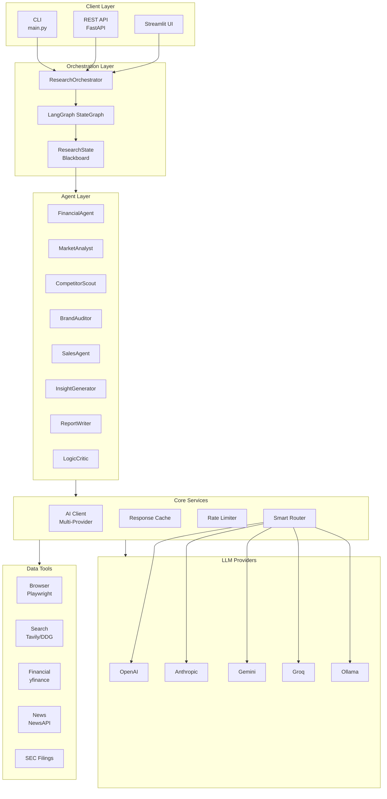
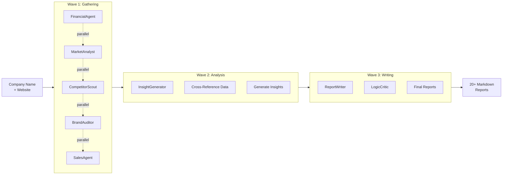
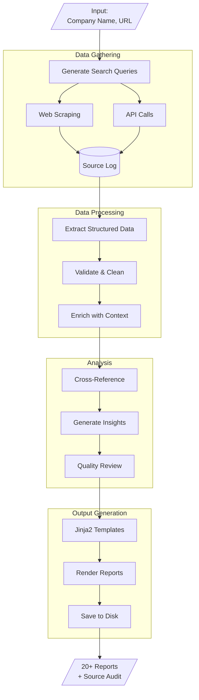
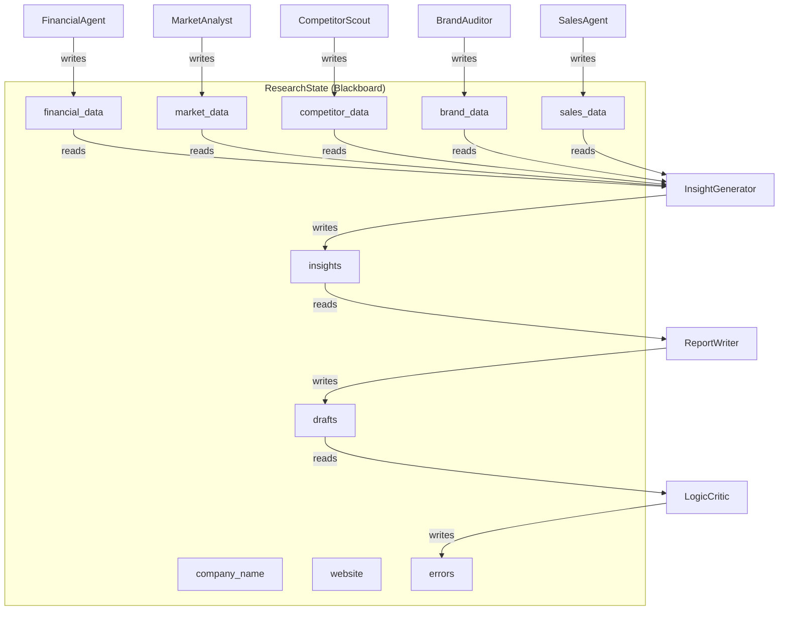
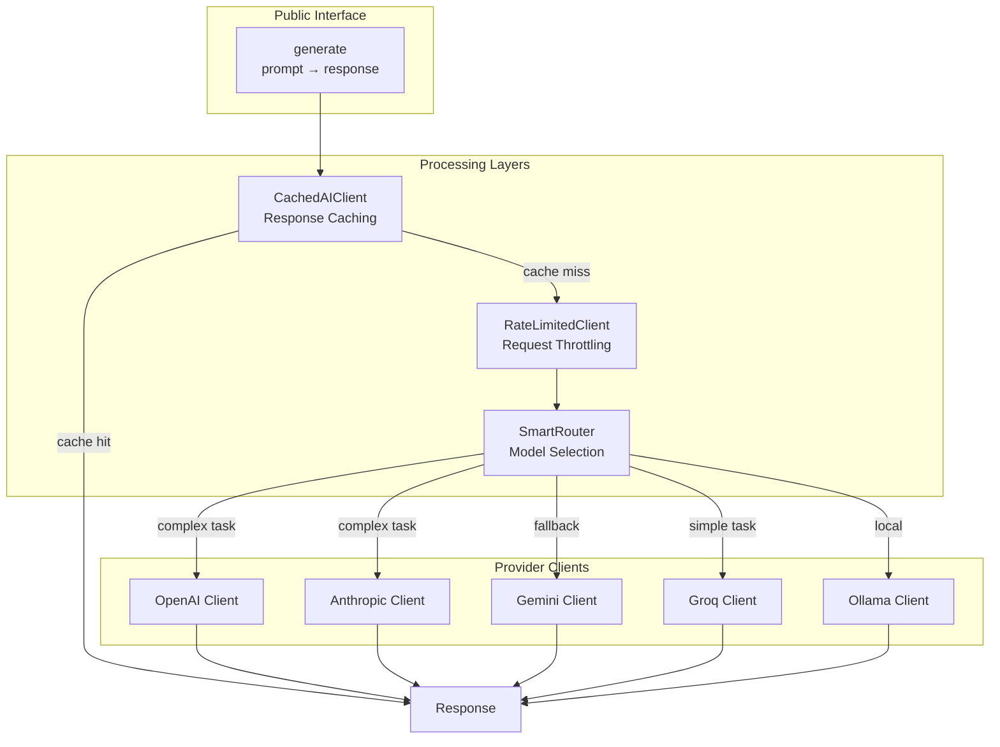
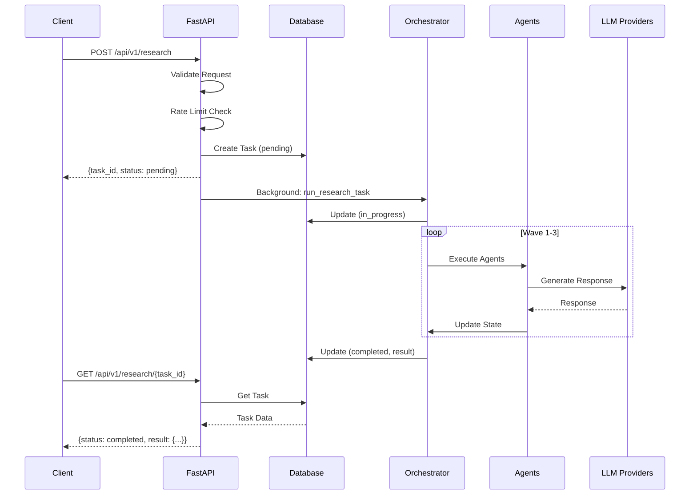
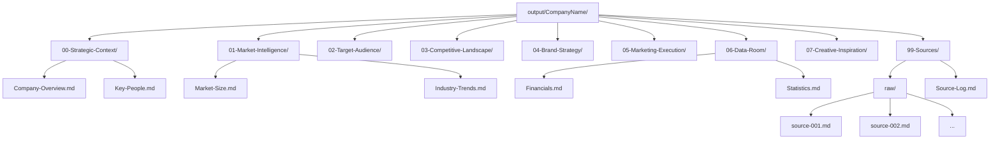

# Architecture Diagrams

Visual representations of the Company Researcher system architecture.

## High-Level Architecture



## 3-Wave Execution Model



## Data Flow



## Agent Communication (Blackboard Pattern)



## AI Client Architecture



## API Request Flow



## Output File Structure



## Rendering Diagrams

These diagrams use [Mermaid](https://mermaid.js.org/) syntax. To view:

1. **GitHub**: Renders automatically in markdown files
2. **VS Code**: Install "Markdown Preview Mermaid Support" extension
3. **Online**: Use [Mermaid Live Editor](https://mermaid.live/)
4. **Export**: Use Mermaid CLI to export as PNG/SVG

```bash
# Install Mermaid CLI
npm install -g @mermaid-js/mermaid-cli

# Export to PNG
mmdc -i ARCHITECTURE_DIAGRAMS.md -o diagram.png
```
