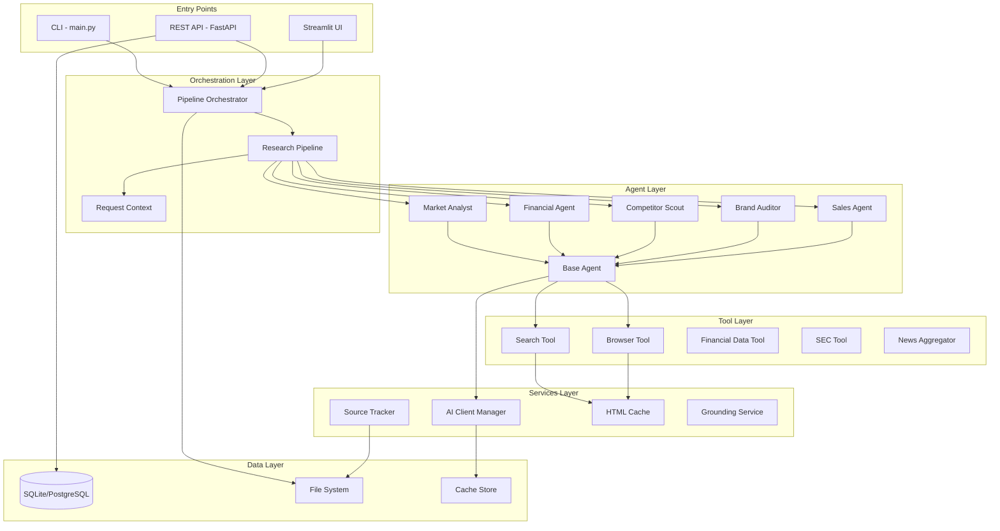
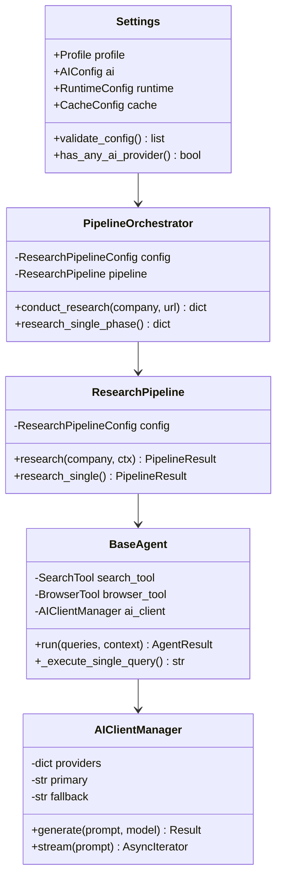
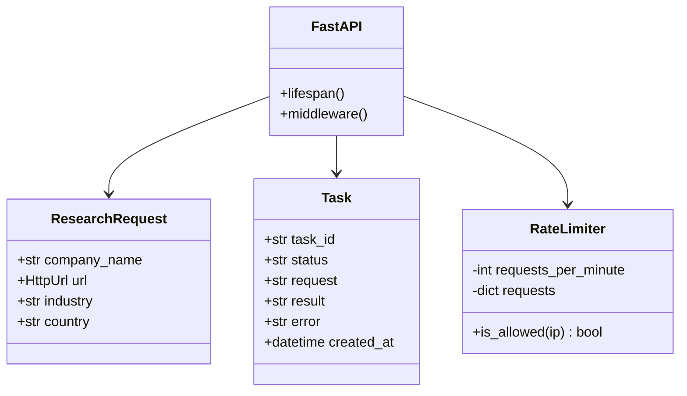
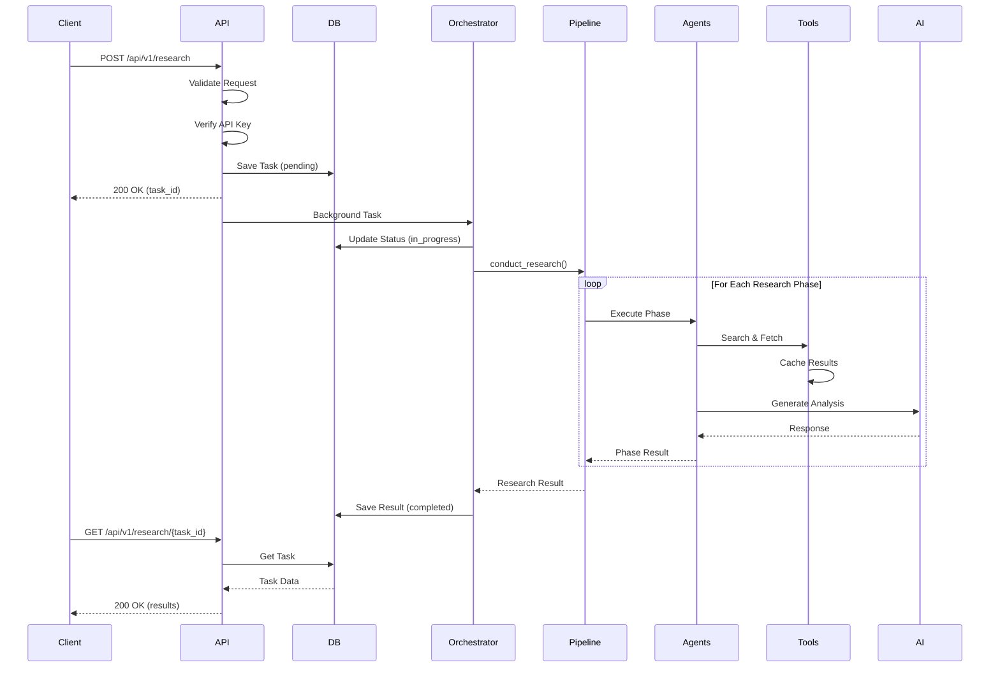
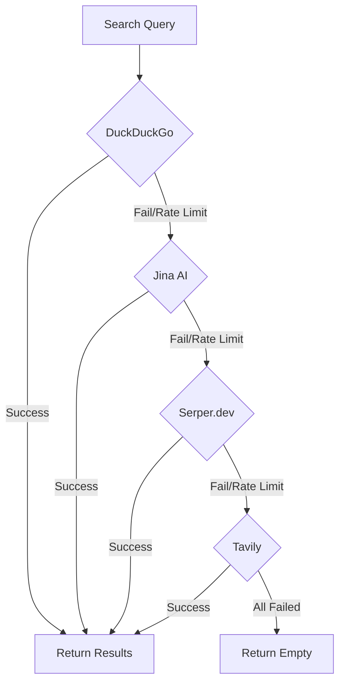
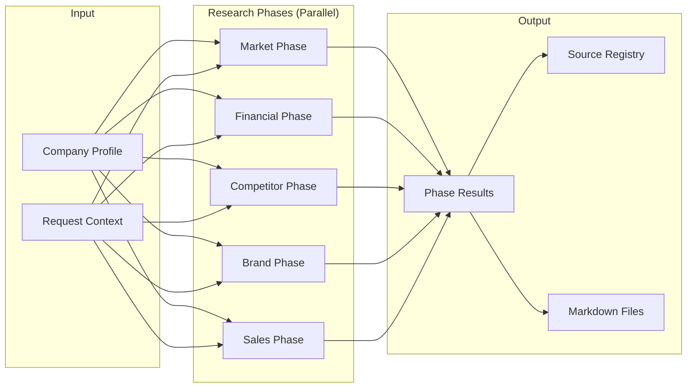
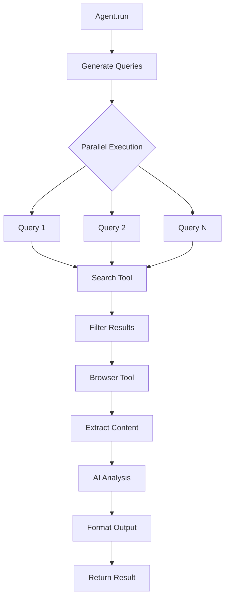
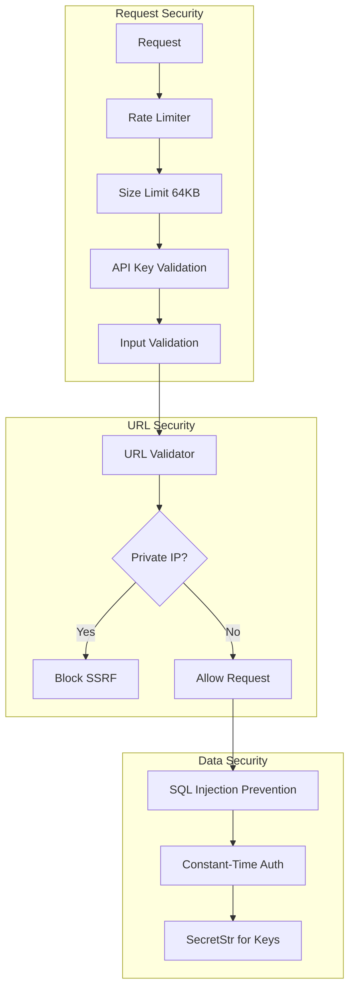

# Company Researcher Architecture

This document provides a comprehensive overview of the Company Researcher system architecture, including component diagrams, data flows, and key design patterns.

## System Overview

The Company Researcher is a multi-agent autonomous research platform that generates deep B2B and investment intelligence reports. The system follows a pipeline architecture with specialized agents for different research domains.



## Component Architecture

### Core Components



### API Layer



## Data Flow

### Research Request Flow



### Search Provider Fallback



## Pipeline Architecture

### Research Pipeline Stages



### Agent Execution Flow



## Directory Structure

```
company-researcher/
├── src/
│   ├── agents/           # AI agents for research
│   │   ├── base_agent.py     # Abstract base class
│   │   ├── specialists.py    # Domain-specific agents
│   │   └── deep_research.py  # Recursive research
│   ├── api/              # REST API
│   │   ├── app.py           # FastAPI application
│   │   ├── models.py        # Request/Response models
│   │   └── database.py      # Database config
│   ├── core/             # Core utilities
│   │   ├── config.py        # Configuration
│   │   ├── ai_client.py     # LLM provider abstraction
│   │   ├── types.py         # Data models
│   │   └── logger.py        # Logging
│   ├── pipeline/         # Orchestration
│   │   ├── orchestrator.py  # Main orchestrator
│   │   ├── research_pipeline.py
│   │   └── stages/          # Pipeline stages
│   ├── tools/            # External integrations
│   │   ├── search_tool.py   # Search interface
│   │   ├── browser.py       # Web scraping
│   │   └── search/          # Search providers
│   ├── services/         # Business logic
│   │   ├── source_tracker.py
│   │   ├── html_cache.py
│   │   └── grounding_service.py
│   └── prompts/          # LLM prompt templates
├── docs/
│   ├── api/              # API documentation
│   ├── architecture/     # Architecture docs
│   └── guides/           # User guides
├── tests/                # Test suite
└── outputs/              # Generated reports
```

## Key Design Patterns

### 1. Pipeline Pattern
The system uses an explicit pipeline architecture instead of LangGraph's state machine:
- **Stages**: Each research phase is a discrete stage
- **Context**: Shared state via `RequestContext`
- **Results**: Typed `PipelineResult` with status

### 2. Provider Chain (Fallback)
Both AI and search components use fallback chains:
```python
# Search: DuckDuckGo -> Jina -> Serper -> Tavily
# AI: Primary Provider -> Fallback Provider -> Ollama
```

### 3. Result Type (Rust-style)
Explicit error handling without exceptions:
```python
result = await search_tool.search_safe(query)
if result.is_ok:
    process(result.unwrap())
else:
    handle_error(result.unwrap_err())
```

### 4. Dependency Injection
Loose coupling via container:
```python
container.register(SearchTool, lifecycle=Lifecycle.SINGLETON)
search_tool = container.resolve(SearchTool)
```

### 5. Profile-Based Configuration
Environment-specific defaults:
- **Development**: Debug logging, 3 search results
- **Staging**: Info logging, 5 search results
- **Production**: Warning logging, 10 search results

## Security Architecture



## Performance Considerations

| Component | Strategy | Default |
|-----------|----------|---------|
| Search | Multi-provider fallback | DuckDuckGo first |
| Browser | Semaphore rate limiting | 5 concurrent |
| AI | Response caching | 1 hour TTL |
| Pipeline | Parallel phase execution | Enabled |
| Database | Connection pooling | SQLAlchemy pool |

## Monitoring & Observability

- **Request ID**: Unique ID per request for tracing
- **Structured Logging**: JSON-formatted logs with context
- **Health Checks**: `/health` and `/health/detailed` endpoints
- **Error Tracking**: Langfuse integration (optional)

## Related Documentation

- [API Reference](../api/openapi.yaml) - OpenAPI specification
- [Deployment Guide](../guides/DEPLOYMENT.md) - Production deployment
- [Troubleshooting](../guides/TROUBLESHOOTING.md) - Common issues
- [Configuration](../guides/CONFIGURATION.md) - Environment variables
