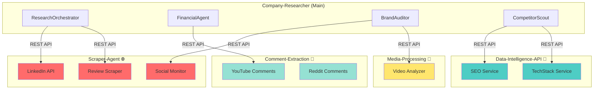

# Tool Architecture Plan: Monorepo vs Microservices

**Decision Framework**: Which tools stay in `Company-resarcher` vs. which become separate repos?

---

## 🏗️ Architecture Principles

### ✅ Keep in Company-Researcher (Tight Coupling)

- Tool is **specific** to company research use case
- Uses **existing dependencies** (LLM client, config)
- **Simple wrappers** around APIs (<100 lines)
- **Low reuse potential** across other projects

### 🔀 Extract to Separate Repo (Loose Coupling)

- Tool is **general-purpose** and reusable
- Has **complex logic** (anti-bot, rate limiting, queue management)
- Requires **independent scaling**
- **High reuse potential** (comment extraction, marketing research, etc.)
- Could be **sold/shared** as a standalone product

---

## 📦 REPO 1: Company-Researcher (Main Project)

### Tools to Keep Here

#### 1. **FinancialDataTool** ✅ KEEP

**Why**: Lightweight wrapper around yfinance, company-research specific

```python
# src/tools/financial_data.py (100 lines)
class FinancialDataTool:
    async def get_company_info(self, ticker: str) -> Dict:
        return yf.Ticker(ticker).info
```

#### 2. **StructuredExtractorTool** ✅ KEEP

**Why**: Uses existing LLM client, tightly coupled to agent prompts

```python
# src/tools/structured_extractor.py
class StructuredExtractorTool:
    def __init__(self, ai_client):
        self.ai = ai_client  # Uses existing client
```

#### 3. **NewsAggregator (Simple)** ✅ KEEP

**Why**: Just a thin wrapper around NewsAPI, no complex logic

```python
# src/tools/news_aggregator.py (150 lines)
class NewsAggregatorTool:
    def __init__(self):
        self.client = NewsApiClient(api_key)
```

---

## 🌐 REPO 2: **Scraper-Agent** (New Microservice)

**Purpose**: Handle all complex web scraping with anti-bot evasion, queue management, and caching

### Tools to Extract Here

#### 1. **LinkedIn Scraper** 🔴 EXTRACT

**Why**: Complex, reusable across sales/recruiting projects, rate limiting critical

- Rotating proxies
- Session management
- CAPTCHA handling (if not using ProxyCurl)
- Company page scraping
- People search
- Job posting extraction

#### 2. **Social Media Scraper** 🔴 EXTRACT

**Why**: Generic social intelligence, reusable for brand monitoring, sentiment analysis

- Twitter/X scraping (snscrape)
- Reddit monitoring (PRAW)
- Instagram scraping
- LinkedIn posts
- Rate limiting per platform

#### 3. **Review Aggregator** 🔴 EXTRACT

**Why**: Complex multi-source scraping, reusable for competitor research

- G2 scraper
- Capterra scraper
- Glassdoor scraper
- TrustRadius scraper
- Google Reviews scraper
- Sentiment analysis

#### 4. **Job Posting Scraper** 🔴 EXTRACT

**Why**: Reusable for recruiting tools, growth signal tracking

- LinkedIn Jobs
- Indeed
- Glassdoor
- Company career pages

#### 5. **Enhanced BrowserTool** 🟡 CONSIDER

**Why**: Could be enhanced with advanced features and shared

- Current version: Keep in Company-researcher
- Future version: Extract if you add:
  - Stealth mode (undetected-chromedriver)
  - Residential proxies
  - Screenshot/PDF generation
  - JavaScript rendering improvements

### Scraper-Agent Architecture

```
scraper-agent/
├── src/
│   ├── scrapers/
│   │   ├── linkedin.py
│   │   ├── social_media.py
│   │   ├── reviews.py
│   │   ├── jobs.py
│   │   └── browser_core.py
│   ├── queue/
│   │   ├── redis_queue.py
│   │   └── rate_limiter.py
│   ├── cache/
│   │   └── content_cache.py
│   ├── api/
│   │   └── fastapi_app.py  # REST API
│   └── workers/
│       └── celery_tasks.py
├── docker-compose.yml
└── README.md
```

### API Design

```python
# POST /scrape/linkedin/company
{
  "company_url": "https://linkedin.com/company/microsoft",
  "include": ["employees", "about", "jobs"]
}

# Response
{
  "job_id": "abc123",
  "status": "queued"
}

# GET /jobs/abc123
{
  "status": "completed",
  "data": {
    "name": "Microsoft",
    "employees": 221000,
    "recent_hires": [...]
  }
}
```

---

## 🧠 REPO 3: **Data-Intelligence-API** (New Microservice)

**Purpose**: Centralized wrapper for 3rd-party data APIs with caching, fallbacks, cost tracking

### Tools to Extract Here

#### 1. **SEO & Traffic Tool** 🔴 EXTRACT

**Why**: Expensive APIs (SimilarWeb, Ahrefs), needs caching and cost management

- Traffic estimation
- Keyword research
- Backlink analysis
- Competitor comparison

#### 2. **TechStack Detector** 🔴 EXTRACT

**Why**: Reusable for competitive intelligence, lead scoring

- BuiltWith API
- Wappalyzer API
- Tech category tagging

#### 3. **Patent Research Tool** 🟡 CONSIDER

**Why**: Specialized use case, but could be reusable

- USPTO API wrapper
- Patent classification
- Citation network analysis

#### 4. **Email Hunter/Verification** 🟡 CONSIDER

**Why**: Reusable for sales enablement tools

- Hunter.io integration
- ZeroBounce verification
- Lead enrichment

### Data-Intelligence-API Architecture

```
data-intelligence-api/
├── src/
│   ├── providers/
│   │   ├── seo/
│   │   │   ├── similarweb.py
│   │   │   ├── ahrefs.py
│   │   │   └── semrush.py
│   │   ├── tech_stack/
│   │   │   ├── builtwith.py
│   │   │   └── wappalyzer.py
│   │   └── contact/
│   │       └── hunter_io.py
│   ├── cache/
│   │   └── redis_cache.py  # 7-day cache
│   ├── cost_tracker/
│   │   └── usage_analytics.py
│   └── api/
│       └── fastapi_app.py
└── docker-compose.yml
```

### API Design

```python
# POST /tech-stack/analyze
{
  "url": "https://example.com"
}

# Response (cached for 30 days)
{
  "technologies": [
    {"name": "React", "category": "Frontend", "version": "18.2"},
    {"name": "AWS", "category": "Hosting"}
  ],
  "cost": 0.02  # API cost tracking
}
```

---

## 🎥 REPO 4: **Media-Processing-Service** (New Microservice)

**Purpose**: Handle video/audio transcription and analysis

### Tools to Extract Here

#### 1. **Video Analyzer** 🔴 EXTRACT

**Why**: Heavy processing, reusable for content research

- YouTube transcript extraction
- Earnings call transcription
- Gemini multi-modal analysis
- Key quote extraction

#### 2. **PDF Advanced Parser** 🟡 CONSIDER

**Why**: If you add OCR, table extraction, complex layouts

- Current simple PDF: Keep in Company-researcher
- Enhanced version: Extract if needed

### Media-Processing Architecture

```
media-processing/
├── src/
│   ├── video/
│   │   ├── youtube.py
│   │   ├── transcriber.py  # AssemblyAI, Whisper
│   │   └── analyzer.py
│   ├── audio/
│   │   └── earnings_calls.py
│   └── api/
│       └── fastapi_app.py
└── docker-compose.yml
```

---

## 🗂️ REPO 5: **Comment-Extraction** (Already Exists)

### Integration with Company-Researcher

```python
# src/tools/comment_integration.py
class CommentExtractionTool:
    """Client for existing Comment-Extraction service"""

    async def get_youtube_comments(self, video_url: str):
        response = await httpx.post(
            "http://comment-extraction-service/api/youtube",
            json={"url": video_url}
        )
        return response.json()
```

---

## 📊 Decision Matrix

| Tool                 | Complexity | Reusability | Cost     | Decision           | Target Repo           |
| -------------------- | ---------- | ----------- | -------- | ------------------ | --------------------- |
| FinancialDataTool    | Low        | Low         | Free     | ✅ KEEP            | Company-researcher    |
| StructuredExtractor  | Low        | Medium      | Low      | ✅ KEEP            | Company-researcher    |
| NewsAggregator       | Low        | Medium      | Low      | ✅ KEEP            | Company-researcher    |
| LinkedIn Scraper     | **High**   | **High**    | Med      | 🔴 EXTRACT         | Scraper-Agent         |
| Social Media Scraper | **High**   | **High**    | Low      | 🔴 EXTRACT         | Scraper-Agent         |
| Review Aggregator    | **High**   | **High**    | Med      | 🔴 EXTRACT         | Scraper-Agent         |
| Job Scraper          | Medium     | **High**    | Low      | 🔴 EXTRACT         | Scraper-Agent         |
| SEO Tool             | Medium     | **High**    | **High** | 🔴 EXTRACT         | Data-Intelligence-API |
| TechStack Detector   | Low        | **High**    | **High** | 🔴 EXTRACT         | Data-Intelligence-API |
| Video Analyzer       | **High**   | **High**    | Med      | 🔴 EXTRACT         | Media-Processing      |
| Patent Tool          | Medium     | Medium      | Free     | 🟡 KEEP (for now)  | Company-researcher    |
| Email Hunter         | Low        | **High**    | Med      | 🟡 EXTRACT (later) | Data-Intelligence-API |

---

## 🚀 Implementation Phases

### Phase 1: Keep It Simple (Week 1-2)

**Approach**: Add all tools directly to Company-researcher as simple wrappers

✅ Implement in `src/tools/`:

- `financial_data.py`
- `news_aggregator.py`
- `structured_extractor.py`

**Why**: Fastest time to value, validate use cases first

---

### Phase 2: Extract Scraper-Agent (Week 3-4)

**Trigger**: When you need LinkedIn data or complex scraping

🔴 Create new repo: `Scraper-Agent`

- Migrate `BrowserTool` (enhanced version)
- Add LinkedIn scraper
- Add Review aggregator
- Deploy as FastAPI service
- Update Company-researcher to call API

**Benefits**:

- Shared across Comment-Extraction and Company-researcher
- Independent rate limiting
- Can sell as standalone product

---

### Phase 3: Extract Data-Intelligence (Month 2)

**Trigger**: When you subscribe to paid APIs (SimilarWeb, BuiltWith)

🔴 Create new repo: `Data-Intelligence-API`

- SEO Tool
- TechStack Detector
- Cost tracking and caching

**Benefits**:

- Centralized API cost management
- Shared cache reduces costs
- Usage analytics

---

### Phase 4: Extract Media-Processing (Month 3)

**Trigger**: When you need video analysis at scale

🔴 Create new repo: `Media-Processing-Service`

- Video Analyzer
- Transcript extraction

---

## 🔗 Microservices Communication



---

## 🛠️ Recommended Immediate Actions

### This Week

1. ✅ **Keep it simple**: Implement top 3 tools in Company-researcher directly

   - `financial_data.py`
   - `news_aggregator.py`
   - `structured_extractor.py`

2. ✅ **Validate**: Test with real company research tasks

### Next 2 Weeks

3. 🔴 **Create Scraper-Agent repo** if you need:

   - LinkedIn data
   - G2/Capterra reviews
   - Social media monitoring

4. 🔴 **Design API contract** between Company-researcher and Scraper-Agent

### Month 2

5. 🔴 **Evaluate ROI** of paid APIs
6. 🔴 **Create Data-Intelligence-API** if subscribing to SimilarWeb/BuiltWith

---

## 💡 Key Insight

**Start monolithic, extract when needed.**

Don't over-engineer. Build tools in Company-researcher first. Extract to microservices when:

- ✅ Tool is proven valuable (used >100 times)
- ✅ Needed by multiple projects (Comment-Extraction + Company-researcher)
- ✅ Complex rate limiting/scaling needed
- ✅ Expensive APIs requiring cost optimization

---

## 📚 Reference Architecture

Your ecosystem could look like:

```
Ai-Whisperers/
├── Company-resarcher/          # Main research orchestrator
├── Comment-Extraction/          # Existing (YouTube, Reddit)
├── Scraper-Agent/              # New (LinkedIn, Reviews, Social)
├── Data-Intelligence-API/      # New (SEO, TechStack, Contact)
├── Media-Processing-Service/   # New (Video, Audio, Transcripts)
└── Marketing-Agent/            # Future (uses all above services)
```

**Each service**:

- Independent deployment
- Own rate limits
- Own caching
- Own scaling
- REST API interface

**Company-researcher** becomes the orchestrator that composes these services.

---

**Next Step**: Implement Phase 1 (keep it simple) first, then decide which tools justify extraction based on actual usage patterns.
